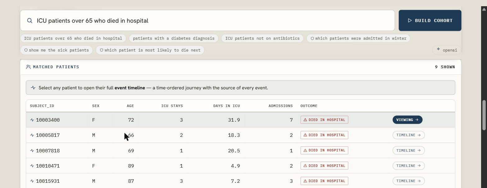
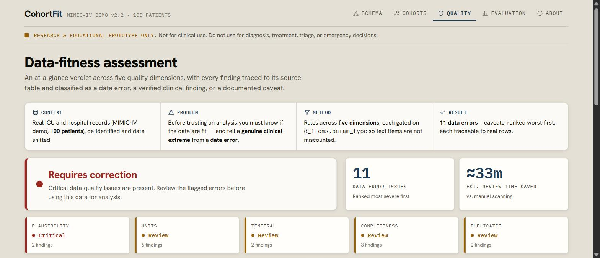
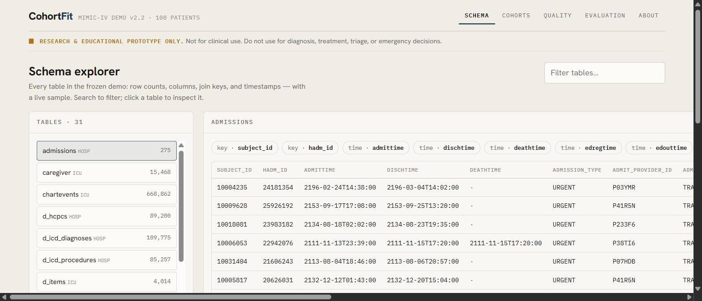
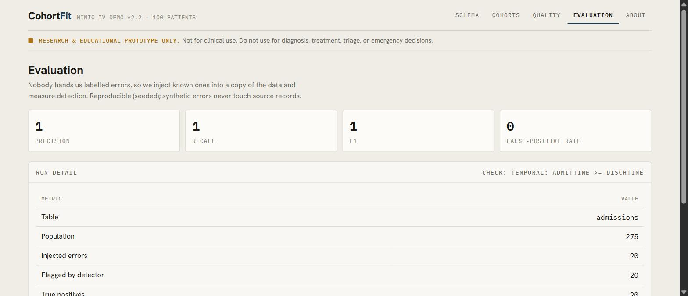

# CohortFit

> **Research and educational prototype only. Not for clinical use. Do not use for diagnosis, treatment, triage, or emergency decisions.**

**CohortFit turns a plain-English cohort description into a transparent, showable query — who's in, who's out, and why — then scores whether the data are actually fit to trust, telling real clinical findings apart from data errors, and only ever suggesting fixes that are reversible and explained.** Built for the **Sofstica AI Hackathon 2026**, "AI for Smarter Patient Care", **Track 2 — Cohort & Data Quality Explorer**, on the MIT-LCP **MIMIC-IV Demo v2.2** dataset.

The pitch in one line: **honesty as a feature** — CohortFit's most valuable job is telling a researcher *when their analysis isn't possible*, before they waste weeks on unfit data.

## 🔗 Live demo

**App:** https://cohortfit.vercel.app

Next.js frontend on Vercel; FastAPI + DuckDB backend on Heroku (container). Deidentified MIMIC-IV **Demo** data only.

---

## 🌟 North Star — what 99.9% of teams won't do

Most participants will demo a happy-path feature. We are going for something judges rarely see: **a system whose every minute detail is deliberate, and whose behavior — not just its features — is engineered and evidenced.** This is what the human ↔ Claude-Code process (multi-agent research, systematic exploration, live browser testing, a bespoke design system) makes possible, and it's the bar we hold on every commit.

Concretely, we commit to doing these — most teams will do none:

1. **Honest, quantified evaluation.** We inject our own labeled errors into a *copy* of the data and report real **precision / recall / false-positive rate** per table and dimension — with uncertainty, not a single headline number. (Most teams show no metrics at all.)
2. **Real-finding-vs-data-error discipline.** The plausibility rule is gated on `d_items.param_type` and reference ranges, so an extreme-but-real lab is *not* flagged as a typo. This is the exact strict rule Track 2 demands — and the hard part almost everyone gets wrong.
3. **Abstention as a first-class feature.** We demo the **failure path**: when the data can't support a request, the tool says so and explains why, instead of inventing an answer.
4. **Provenance to the exact row.** Every flag and every cohort member links back to its source table, column, id, and time — nothing is a black box.
5. **Reproducibility by construction.** The IR→SQL compiler is deterministic; each build returns a `query_hash` (a digest of the compiled SQL + IR) and the cohort exports as a re-runnable "recipe" JSON — so a query reproduces exactly, even if the model drifts. (Nothing is persisted server-side; the store is read-only.)
6. **Licence-aware data minimization.** We follow the PhysioNet licence and the brief's rule to *minimize data sent to external services*: the model receives only a schema-describing system prompt (a schema description + an itemid reference list) plus the user's text — no patient rows, no summary statistics, no DDL. We never dump the dataset to any service. (This is the requirement met deliberately, not an over-constraint that limits what the tool can do.)
7. **System behavior over feature count.** We deliberately test and show how CohortFit handles **missing, ambiguous, duplicate, mis-timed, and out-of-scope** inputs — because a research tool is judged by how it behaves at the edges.
8. **Craft in every detail.** Every number in our docs is *measured* and traceable; a from-scratch explainer for zero-context readers; a bespoke, consistent **design system** (not a template, not AI-slop); tracked UI screenshots; dead-code hygiene; disciplined commits. Nothing is left to "good enough."

We maintain and grade ourselves against this North Star in [`PROGRESS.md`](PROGRESS.md). If a change doesn't move us toward it, we reconsider the change.

---

## 🚀 Quick start

The whole stack runs in Docker — one command:

```bash
docker compose up --build
# frontend → http://localhost:3000   ·   backend API → http://localhost:8000
```

`OPENAI_API_KEY` is **optional**: without it, the cohort builder uses a disclosed keyword fallback so everything works offline. To enable the OpenAI path, copy `.env.example` → `.env` and set your key.

Run the backend tests (34, in Docker):

```bash
docker compose run --rm backend pytest
```

## 🧭 How it works

```
Plain English ──▶ OpenAI (or keyword fallback) ──▶ validated JSON IR ──▶ compiler ──▶ DuckDB SQL
   (browser)        (schema + text only)            (never raw SQL)      (deterministic)   │
                                                                                           ▼
  Next.js UI ◀────────── FastAPI ◀───────────────── provenance funnel + subject_ids + query_hash
  (Lab Ledger)          (:8000)                      quality scorecard · reversible fixes · eval
```

- **Frontend:** Next.js 14 (App Router), the *Lab Ledger* design system (`TENTATIVE_FRONTEND_DESIGN_SYSTEM.md`), self-hosted fonts.
- **Backend:** FastAPI + DuckDB over the frozen demo CSVs (read-only). The LLM emits a validated **IR**, never executable SQL; a deterministic compiler runs it.
- **Reproducible:** the IR→SQL compiler is deterministic; each build returns a `query_hash` and the cohort exports as a re-runnable recipe JSON; the eval harness is seeded. (Nothing is persisted server-side — the store is read-only.)

## 🖥️ The app (verified screenshots)

| Cohorts — builder + Provenance Ledger | Quality — scorecard + findings |
|---|---|
|  |  |
| **Schema explorer** | **Evaluation — injected-error metrics** |
|  |  |

Pages: **Schema** (tables, keys, sample) · **Cohorts** (NL → Provenance Ledger 100→44→44→9 + IR/SQL) · **Quality** (R/A/G scorecard, data-error-vs-finding, proposed reversible fixes) · **Evaluation** (precision/recall from self-injected errors) · **About/Safety**.

## 📝 Project description (submission pitch)

> **CohortFit** turns a plain-English cohort description into a transparent, showable query — who's in, who's out, and why — then scores whether the data are fit to trust, telling real clinical findings from data errors. **Built:** a Next.js + FastAPI/DuckDB app over MIMIC-IV Demo (100 patients) with a Schema Explorer; a Cohort Builder whose *Provenance Ledger* shows the inclusion→exclusion funnel (100→44→44→9) plus the IR and SQL; a red/amber/green Data-Fitness Scorecard that separates data errors from real findings; reversible, rule-backed fixes (never mutating source); and an Evaluation page with real precision/recall from self-injected errors. **Problem:** researchers waste weeks before discovering data can't support a study. **How:** the LLM emits a validated IR (not SQL); our compiler runs it on DuckDB; every flag traces to a real row; it abstains when unsupported. **More time:** broaden NL coverage, harder data-quality dimensions, patient-grouped cross-validation.

## 📚 Documentation

- [`TENTATIVE_AGILE_PLAN.md`](TENTATIVE_AGILE_PLAN.md) — product plan, use cases, demo script.
- [`docs/TRACK2_REQUIREMENTS.md`](docs/TRACK2_REQUIREMENTS.md) — the hackathon brief, extracted.
- [`docs/RESEARCH_AND_EXPLORATION.md`](docs/RESEARCH_AND_EXPLORATION.md) — data map, evidence, model/method R&D (from-scratch explainer + real samples).
- [`docs/EVALUATION_REPORT.md`](docs/EVALUATION_REPORT.md) · [`docs/SAFETY_STATEMENT.md`](docs/SAFETY_STATEMENT.md) — required deliverables.
- [`TENTATIVE_FRONTEND_DESIGN_SYSTEM.md`](TENTATIVE_FRONTEND_DESIGN_SYSTEM.md) — the design system.
- [`PROGRESS.md`](PROGRESS.md) — living status + decision log.

---

## ⚠️ Required setup — do this before working on the project

The official MIMIC code repository is **not** included in this repo (it is gitignored because it is large). You **must** download it and place it in the project root for this project to work:

1. Download the repository from **https://github.com/MIT-LCP/mimic-code** (e.g. "Code → Download ZIP", which gives `mimic-code-main.zip`).
2. **Extract the zip** into the project root — the code must be present in **folder format, not as a `.zip`**.
3. Ensure the resulting directory is named exactly **`mimic-code-main/`** and sits at the project root.

`mimic-code-main/` is a **cited reference** (its `vitalsign.sql` plausibility bounds inform our rules) and a project convention — keep it present for provenance. Note: the runnable app itself needs only **Docker + the demo data** (the bounds are already encoded in `backend/app/quality/ranges.py`), so the [Quick start](#-quick-start) works without opening the repo.

## Data & repo layout

This project uses the MIT-LCP MIMIC-IV demo dataset together with the official MIMIC code repository.

### `mimic-iv-clinical-database-demo-2.2/`
The **extracted** contents of `mimic-iv-clinical-database-demo-2.2.zip` (the MIMIC-IV Clinical Database Demo v2.2). The original zip shipped every table as a `.csv.gz`; those have all been decompressed to plain `.csv` in place, preserving the archive's folder structure. This folder **is** the dataset — it is committed to the repo.

### `mimic-code-main/`
The downloaded source of the official MIMIC code repository: **https://github.com/MIT-LCP/mimic-code**.

- This folder is **gitignored** (see `.gitignore`) — it is a large upstream repo and is not tracked here.
- It **must** be present on disk to work with this project. Download/clone it from the URL above and place it here **in folder format** (extracted, not as a `.zip`). The directory name must be `mimic-code-main/`. See [Required setup](#️-required-setup--do-this-before-working-on-the-project) above.

### `mimic-iv-docs/`
The official MIMIC-IV **prose documentation**, copied into the project root so the docs are available without opening the source zip/site again.

- Source: the `docs/iv/` folder inside `mimic.mit.edu-main.zip` — the downloaded repo of the MIMIC documentation website **https://github.com/MIT-LCP/mimic.mit.edu** (published at https://mimic.mit.edu/docs/iv/). This is the Jekyll source for the docs site.
- Contents (66 markdown files): `about/` (changelog, concepts, schema-overview, whatsnew), `modules/` with per-table docs for `hosp/`, `icu/`, `ed/`, `cxr/`, `ecg/`, `note/`, and `tutorials/`. The `modules/hosp/*.md` and `modules/icu/*.md` files document every table present in `mimic-iv-clinical-database-demo-2.2/`.
- This is a static copy of `docs/iv/`; re-copy it from a fresh `mimic.mit.edu-main.zip` if the docs are updated.

## Full tree of `mimic-iv-clinical-database-demo-2.2/`

```
mimic-iv-clinical-database-demo-2.2/
├── LICENSE.txt
├── README.txt
├── SHA256SUMS.txt
├── demo_subject_id.csv
├── hosp/
│   ├── admissions.csv
│   ├── d_hcpcs.csv
│   ├── d_icd_diagnoses.csv
│   ├── d_icd_procedures.csv
│   ├── d_labitems.csv
│   ├── diagnoses_icd.csv
│   ├── drgcodes.csv
│   ├── emar.csv
│   ├── emar_detail.csv
│   ├── hcpcsevents.csv
│   ├── labevents.csv
│   ├── microbiologyevents.csv
│   ├── omr.csv
│   ├── patients.csv
│   ├── pharmacy.csv
│   ├── poe.csv
│   ├── poe_detail.csv
│   ├── prescriptions.csv
│   ├── procedures_icd.csv
│   ├── provider.csv
│   ├── services.csv
│   └── transfers.csv
└── icu/
    ├── caregiver.csv
    ├── chartevents.csv
    ├── d_items.csv
    ├── datetimeevents.csv
    ├── icustays.csv
    ├── ingredientevents.csv
    ├── inputevents.csv
    ├── outputevents.csv
    └── procedureevents.csv
```

## Tree of `mimic-iv-docs/` (from `docs/iv/`)

```
mimic-iv-docs/
├── index.md
├── about/
│   ├── changelog.md
│   ├── concepts.md
│   ├── index.md
│   ├── schema-overview.md
│   └── whatsnew.md
├── modules/
│   ├── index.md
│   ├── cxr/
│   │   ├── index.md
│   │   └── record_list.md
│   ├── ecg/
│   │   ├── index.md
│   │   ├── machine_measurements.md
│   │   ├── record_list.md
│   │   └── waveform_note_links.md
│   ├── ed/
│   │   ├── diagnosis.md
│   │   ├── edstays.md
│   │   ├── index.md
│   │   ├── medrecon.md
│   │   ├── pyxis.md
│   │   ├── triage.md
│   │   └── vitalsign.md
│   ├── hosp/
│   │   ├── admissions.md
│   │   ├── d_hcpcs.md
│   │   ├── d_icd_diagnoses.md
│   │   ├── d_icd_procedures.md
│   │   ├── d_labitems.md
│   │   ├── diagnoses_icd.md
│   │   ├── drgcodes.md
│   │   ├── emar.md
│   │   ├── emar_detail.md
│   │   ├── hcpcsevents.md
│   │   ├── index.md
│   │   ├── labevents.md
│   │   ├── microbiologyevents.md
│   │   ├── omr.md
│   │   ├── patients.md
│   │   ├── pharmacy.md
│   │   ├── poe.md
│   │   ├── poe_detail.md
│   │   ├── prescriptions.md
│   │   ├── procedures_icd.md
│   │   ├── provider.md
│   │   ├── services.md
│   │   └── transfers.md
│   ├── icu/
│   │   ├── caregiver.md
│   │   ├── chartevents.md
│   │   ├── d_items.md
│   │   ├── datetimesevents.md
│   │   ├── icustays.md
│   │   ├── index.md
│   │   ├── ingredientevents.md
│   │   ├── inputevents.md
│   │   ├── outputevents.md
│   │   └── procedureevents.md
│   └── note/
│       ├── discharge.md
│       ├── discharge_detail.md
│       ├── index.md
│       ├── radiology.md
│       └── radiology_detail.md
└── tutorials/
    ├── bigquery.md
    ├── first-query.md
    ├── index.md
    ├── video.md
    ├── cxr/
    │   ├── index.md
    │   └── study.md
    └── waveform/
        ├── ieee_workshop.md
        └── index.md
```
